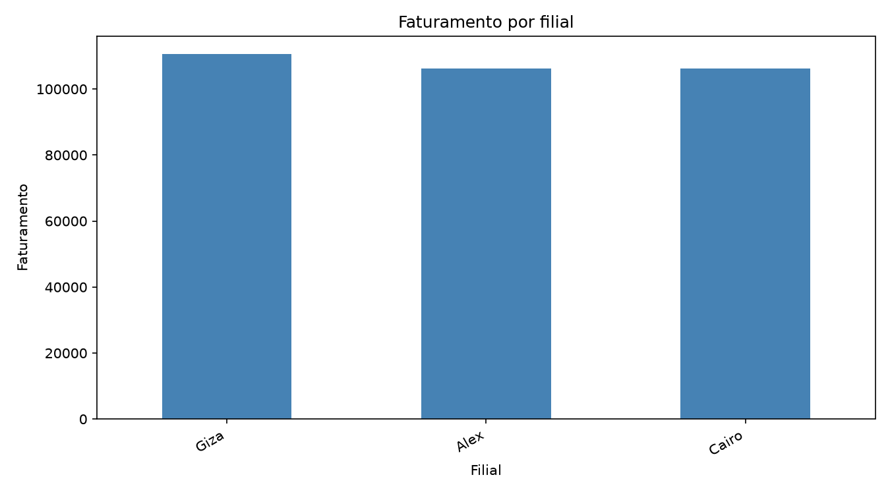
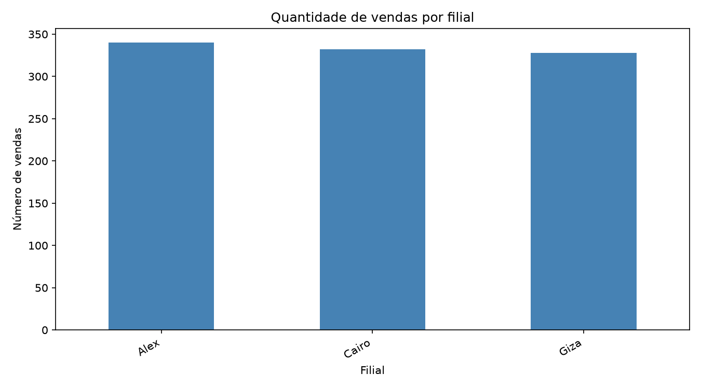
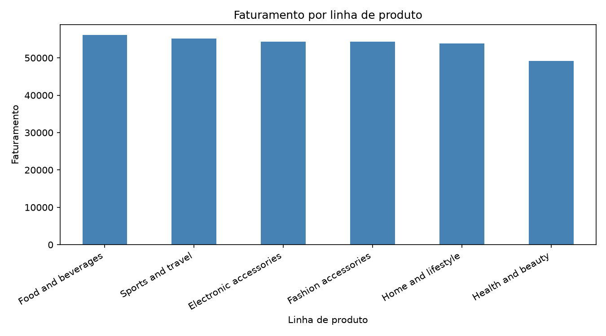
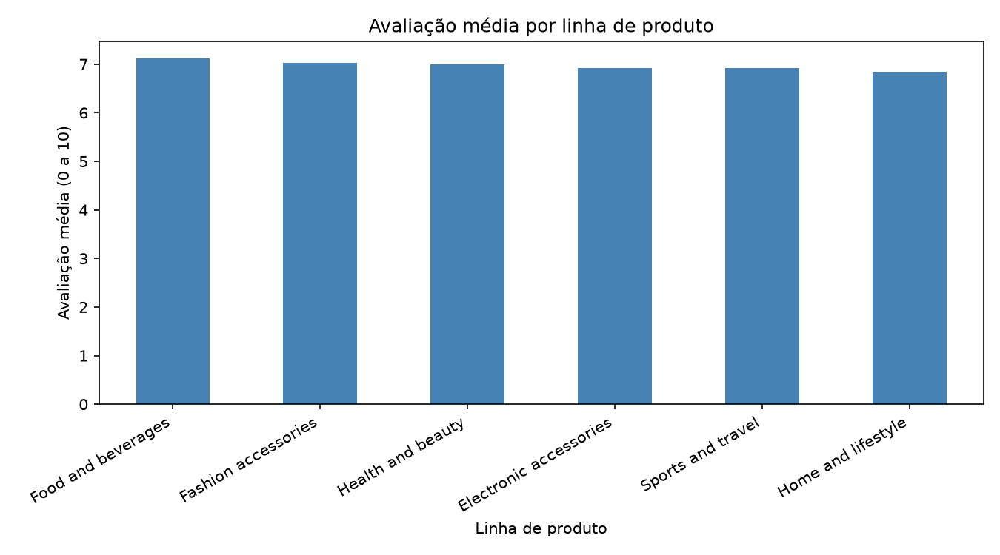
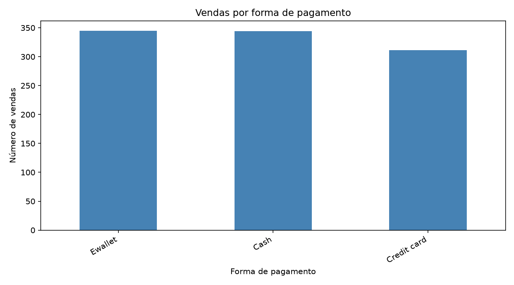
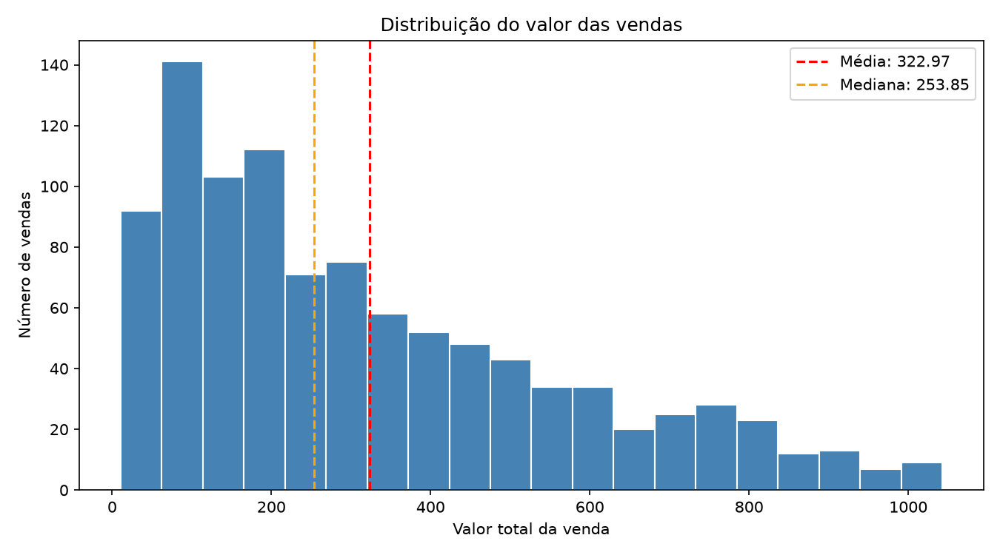
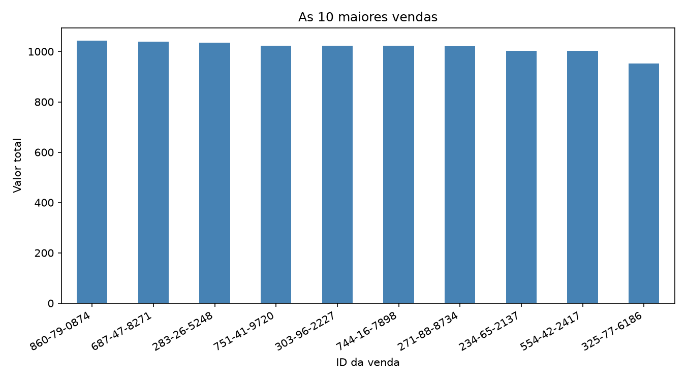
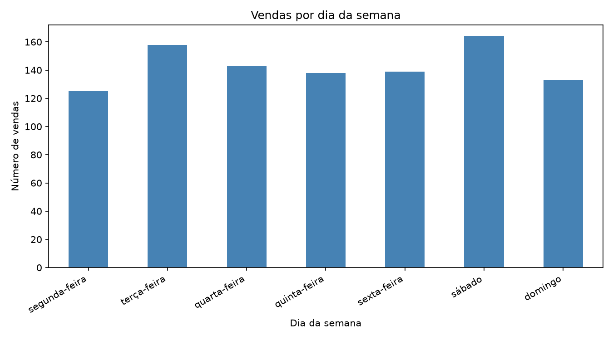

# Projeto Vendas de Supermercado

Fluxo completo de análise de dados desenvolvido com **PostgreSQL, SQL, Python e Pandas**, passando pela leitura e inspeção dos dados, tratamento, modelagem, consultas SQL, análise estatística e visualização dos resultados. O projeto utiliza uma estrutura inspirada na Arquitetura Medallion, separando os dados em uma camada Raw e uma camada Tratada.

Os dados são de vendas de uma rede de supermercados, a partir do dataset público [Supermarket Sales](https://www.kaggle.com/datasets/faresashraf1001/supermarket-sales), com 1.000 vendas distribuídas em 3 filiais.

# Tecnologias

- **Python 3 e Pandas** — leitura, tratamento e análise dos dados
- **Matplotlib** — geração dos gráficos
- **PostgreSQL e SQL** — banco de dados, tabelas, constraints e consultas
- **kagglehub** — download do dataset
- **python-dotenv, SQLAlchemy e psycopg2** — configuração e conexão com o banco
- **Git e GitHub** — versionamento do projeto, utilizando Conventional Commits

# Estrutura do projeto

```text
sql/
├── 01_criar_banco.sql      criação do banco vendas_supermercado
├── 02_criar_tabelas.sql    tabelas raw_vendas e vendas_tratadas, com constraints
└── 03_consultas.sql        consultas SQL e exportação para CSV

src/
├── 00_baixar_dados.py      download do dataset do Kaggle
├── 01_leitura_dados.py     leitura e inspeção inicial do CSV
├── 02_etl_vendas.py        limpeza, tipagem e criação de colunas derivadas
└── 03_estatistica.py       estatística, respostas de negócio e gráficos

data/
├── raw/                     dados brutos e exportados do banco
└── processed/               dados tratados e dicionário de dados

resultados/                  gráficos e respostas_negocio.txt
```

# Como executar

## 1. Clonar o repositório

```bash
git clone https://github.com/rossie-katherine/projeto-vendas-supermercado
cd projeto-vendas-supermercado
```

## 2. Criar o ambiente virtual

No Windows:

```bash
python -m venv venv
venv\Scripts\activate
```

Depois, instale as dependências:

```bash
pip install -r requirements.txt
```

## 3. Configurar o PostgreSQL

Crie um arquivo `.env` na raiz do projeto com os dados da sua instalação do PostgreSQL.

```env
DB_HOST=localhost
DB_PORT=5432
DB_NAME=vendas_supermercado
DB_USER=postgres
DB_PASSWORD=sua_senha
```

O arquivo `.env` não deve ser enviado para o Git.

## 4. Baixar o dataset

O script baixa o dataset do Kaggle e salva os dados em `data/raw/`.

```bash
python src\00_baixar_dados.py
```

## 5. Criar o banco e as tabelas

No pgAdmin, execute primeiro:

```text
sql/01_criar_banco.sql
```

Depois, conectado ao banco `vendas_supermercado`, execute:

```text
sql/02_criar_tabelas.sql
```

## 6. Carregar o CSV na tabela `raw_vendas`

No pgAdmin:

1. Clique com o botão direito na tabela `raw_vendas`.
2. Selecione **Import/Export Data**.
3. Escolha o formato `csv`.
4. Utilize `,` como delimitador.
5. Deixe a opção **Header** ligada.

Depois, confira a quantidade de registros:

```sql
SELECT COUNT(*) FROM raw_vendas;
```

O resultado esperado é **1000**.

## 7. Executar as consultas SQL

Execute as consultas de `sql/03_consultas.sql` uma por vez.

Também é feita a exportação de:

```sql
SELECT * FROM raw_vendas;
```

para:

```text
data/raw/raw_vendas_exportada.csv
```

com o cabeçalho incluído.

## 8. Executar os scripts Python

Os scripts devem ser executados nesta ordem:

```bash
python src\01_leitura_dados.py
python src\02_etl_vendas.py
python src\03_estatistica.py
```

# Camadas de dados

| Camada | Onde fica | O que é |
|---|---|---|
| **Raw** | tabela `raw_vendas` e `data/raw/` | Cópia dos dados originais, mantendo as colunas do CSV |
| **Tratada** | `data/processed/vendas_tratadas.csv` | Dados tipados, tratados e com 3 colunas derivadas |
| **Resultados** | `resultados/` | Respostas de negócio e gráficos |

Na camada tratada foram criadas três colunas derivadas:

- `dia_semana`
- `mes`
- `hora_do_dia`

O dicionário de dados da camada tratada está em:

```text
data/processed/dicionario_dados.md
```

# Modelagem e constraints

A tabela `vendas_tratadas` possui:

- `PRIMARY KEY` em `id_venda`;
- `NOT NULL` nos campos críticos;
- `CHECK` para valores numéricos, garantindo preços e valores maiores ou iguais a zero;
- `CHECK` para quantidade maior que zero;
- `CHECK` para avaliação entre 0 e 10;
- `CHECK` para as categorias de filial, tipo de cliente, forma de pagamento e linha de produto.

Essas regras foram utilizadas para manter a consistência dos dados dentro do banco.

# Decisões de tratamento

A base original já veio sem valores nulos e sem registros duplicados. Mesmo assim, o ETL verifica essas situações e removeria linhas problemáticas caso fossem encontradas. Neste dataset, nenhuma linha precisou ser removida. Também foram verificadas as principais regras de negócio:

- nenhuma linha apresentou valores negativos;
- nenhuma venda apresentou quantidade menor ou igual a zero;
- nenhuma avaliação ficou fora do intervalo de 0 a 10.

A data original está no formato americano (mês/dia/ano) e a hora utiliza o formato de 12 horas. As duas variáveis foram convertidas durante o tratamento. O `valor_total` também foi conferido a partir da relação entre preço, quantidade e imposto, sem divergências. Os valores monetários foram arredondados para 2 casas decimais durante o ETL. Por isso, existe uma pequena diferença no faturamento da filial Cairo entre os resultados do SQL e do Pandas:

- **SQL:** 106.197,67
- **Pandas:** 106.197,74

A diferença ocorre por causa do arredondamento aplicado no tratamento dos dados. Outro ponto importante foi a interpretação da coluna `receita_bruta`. Apesar do nome, ela não representa a receita da venda neste dataset: seu valor corresponde ao imposto. Por isso, para esta análise, faturamento = soma de `valor_total`. Durante a importação para o banco, a linha do cabeçalho acabou entrando como dado. Essa linha foi removida posteriormente e a correção está registrada em `sql/02_criar_tabelas.sql`.

# Resultados

| # | Pergunta | Resposta |
|---|---|---|
| 1 | Filial com maior faturamento | **Giza (Naypyitaw), 110.568,71** |
| 2 | Filial com mais vendas | **Alex (Yangon), 340 vendas** |
| 3 | Linha de produto com maior faturamento | **Food and beverages, 56.144,86** |
| 4 | Linha de produto com melhor avaliação média | **Food and beverages, 7,11** (as médias vão de 6,84 a 7,11, muito parecidas) |
| 5 | Forma de pagamento mais usada | **Ewallet, 345 vendas** (Cash tem 344, praticamente empate) |
| 6 | Valor médio das vendas | **322,97** (mediana 253,85) |
| 7 | Maior venda | **860-79-0874, 1.042,65, filial Giza** |
| 8 | Dia da semana com mais vendas | **Sábado, 164 vendas** |

A hipótese de que a filial com mais vendas seria também a filial com maior faturamento **não se confirmou**.

A filial **Giza** apresentou o maior faturamento, mas teve o menor número de vendas entre as três filiais, com **328 vendas**. Já a filial **Alex** teve o maior número de vendas, com **340**, mas não foi a que mais faturou.










# Sobre o projeto

A proposta foi trabalhar o fluxo completo de uma análise de dados, começando pelos dados brutos e chegando aos resultados finais:

```text
Dataset
   ↓
Dados brutos
   ↓
PostgreSQL
   ↓
SQL
   ↓
ETL com Python + Pandas
   ↓
Dados tratados
   ↓
Análise estatística
   ↓
Gráficos e respostas de negócio
```

O projeto também foi uma forma de praticar, em conjunto, **SQL, PostgreSQL, Python, Pandas, ETL, qualidade de dados, modelagem, validação e análise exploratória**.

# Autora

## Autora

**Rossie Katherine**
[GitHub](https://github.com/rossie-katherine)
Graduada em Ciências Biológicas e Técnica em Tecnologia da Informação, com interesse na aplicação de dados e tecnologia em diferentes áreas.